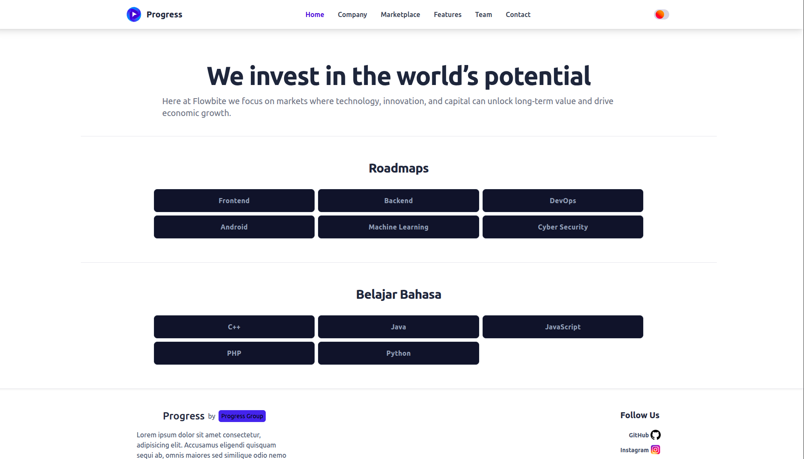
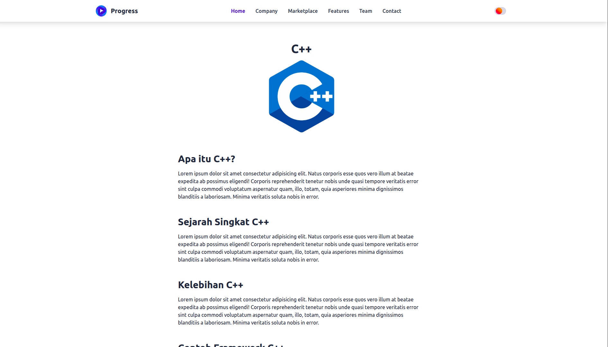

# Progress

Progress is a website that serves as a **learning roadmap for technology**. It helps users understand the learning path for different fields such as **Backend, Frontend**, and more. Additionally, Progress provides a **place to learn various programming languages** with accessible resources.

## Features
- Complete roadmap for Backend, Frontend, and other tech fields
- Learning resources for various programming languages
- Step-by-step tutorials to improve coding skills
- Simple and user-friendly UI

## Preview

<p float="left">
  
  
</p>

## Installation

1. Clone the repository:
```bash
git clone https://github.com/username/progress.git
cd progress
```

2. Install dependencies:
```bash
npm install
```

3. Run the website:
```bash
nodemon app.js
```

> The website will run at `http://localhost:3000` (or the port specified in `app.js`).

## Contribution
Contributions are welcome! Feel free to fork the repository and submit a pull request to add new features or improvements.

## License
MIT License © 2025 Progress
